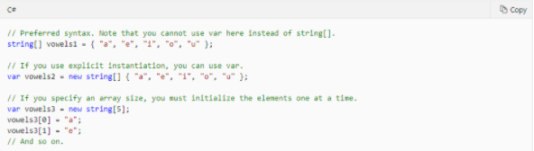
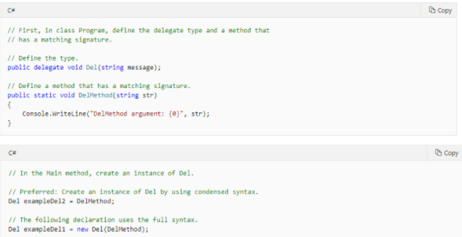

Walled City Studio Style Guide, based on The Ramen Unity Style Guide by stillwwater
===========================

### For file structure, naming conventions and other things

These are guidelines for keeping your project organized and allow your team to quickly find the assets they need. Games are large projects that span several months, thus having standardized conventions that make sense will avoid headaches in the long run.

Note that your team and project might have different needs, use different software, etc. Use this guide only as a base to decide on what works for your team. Every project should have its own, easy to find, style guide, so everyone in the team is up to date in the project's conventions.

# Table of Contents

- [General](#General)
  - [Naming](#Naming)
    - [Folders](#folders)
    - [Debug Folders](#debug-folders)
    - [Code](#code)
    - [Non-code assets](#non-code-assets)
  - [Directory/File structure](#directory-file-structure)
    - [Assets](#assets)
  - [Workflow](#workflow)
    - [Configuration files](#configuration-files)
    - [Audio](#audio)
- [Artists](#artists)
  - [Models](#models)
  - [Textures](#textures)
    - [Textures Suffixes](#Textures-Suffixes)
- [Sound](#Sound)
  - [Audio](#audio)
- [Programmers](#Programmers)
  - [Code Conventions](#Code-conventions)

# General
These rules are for all subteams.

## Naming

No spaces in file or directory names.

### Folders

`PascalCase`

Prefer a deep folder structure over having long asset names.

Directory names should be as concise as possible, prefer one or two words. If a directory name is too long, it probably makes sense to split it into sub directories.

Try to have only one file type per folder. Use `Textures/Trees`, `Models/Trees` and not `Trees/Textures`, `Trees/Models`. That way its easy to set up root directories for the different software involved, for example, Substance Painter would always be set to save to the Textures directory.

If your project contains multiple environments or art sets, use the asset type for the parent directory: `Trees/Jungle`, `Trees/City` not `Jungle/Trees`, `City/Trees`. Since it makes it easier to compare similar assets from different art sets to ensure continuity across art sets.

### Debug Folders

`[PascalCase]`

This signifies that the folder only contains assets that are not ready for production. For example, having an `[Assets]` and `Assets` folder.

### Code

Use `PascalCase`.


### Non-Code Assets

Use `tree_small` not `small_tree`. While the latter sound better in English, it is much more effective to group all tree objects together instead of all small objects.

`camelCase` where necessary. Use `weapon_miniGun` instead of `weapon_gun_mini`. Avoid this if possible, for example, `vehicles_fighterJet` should be `vehicles_jet_fighter` if you plan to have multiple types of jets.

Prefer using descriptive suffixes instead of iterative: `vehicle_truck_damaged` not `vehicle_truck_01`. If using numbers as a suffix, always use 2 digits. And **do not** use it as a versioning system! Use `git` or something similar.

## Directory/File Structure

```
Root
+---Assets
+---Build
\---Tools           # Programs to aid development: compilers, asset managers etc.
```

### Assets

```
Assets
+---Art
|   +---Materials
|   +---Models      # FBX and BLEND files
|   +---Textures    # PNG files
+---Audio
|   +---Music
|   \---Sound       # Samples and sound effects
+---Code
|   +---Scripts     # C# scripts
|   \---Shaders     # Shader files and shader graphs
+---Docs            # Wiki, concept art, marketing material
+---Level           # Anything related to game design in Unity
|   +---Prefabs
|   +---Scenes
|   \---UI
\---Resources       # Configuration files, localization text and other user files.
```

## Workflow

### Configuration Files

File extension: `JSON`

Fast and easy to parse, clean and easy to tweak.

Use binary file formats for files that should not be changed by the player. For multiplayer games store configuration data on a secure server.


# Artists
These rules mainly apply to the art team.

## Models

File extension: `FBX`

Even though Unity supports Blender files by default, it is better to keep what is being worked on and what is a complete, exported model separate. This is also a must when using other software, such as Substance for texturing.

Use `Y up`, `-Z forward` and `uniform scale` when exporting.

## Textures

File extension: `PNG`, `TIFF` or `HDR`

Choose either a `Specularity/Glossiness` or `Roughness/Metallic` workflow. This depends on the software being used and what your artists are more comfortable with. Specularity maps have the advantage of being having the possibility to be RGB maps instead of grayscale (useful for tinted metals), apart from that there is little difference between the result from either workflow.

### Texture Suffixes

Suffix | Texture
:------|:-----------------
`_AL`  | Albedo
`_SP`  | Specular
`_R`   | Roughness
`_MT`  | Metallic
`_GL`  | Glossiness
`_N`   | Normal
`_H`   | Height
`_DP`  | Displacement
`_EM`  | Emission
`_AO`  | Ambient Occlusion
`_M`   | Mask

### RGB Masks

It is good practice to use a single texture to combine black and white masks in a single texture split by each RGB channel. Using this, most textures should have:

```
texture_AL.png  # Albedo
texture_N.png   # Normal Map
texture_M.png   # Mask
```

Channel | Spec/Gloss        | Rough/Metal
:-------|:------------------|:-----------
R       | Specularity       | Roughness
G       | Glossiness        | Metallic
B       | Ambient Occlusion | Ambient Occlusion

#### The blue channel can vary depending on the type of material:

 - For character materials use the `B` channel for *subsurface opacity/strength*
 - For anisotropic materials use the `B` channel for the *anisotropic direction map*

# Sound
These rules mainly apply to the sound team.

## Audio

File extension: `WAV` while mixing, `OGG` in game.

Preload small sound clips to memory, load on the fly for longer music and less frequent ambient noise files.

# Programmers
These rules mainly apply to the programming team.

## Code Conventions
The code conventions for the programming team will be described here.

### Language
English.

### Scripts Directory
1. Use namespaces that match your directory structure.
2. A Framework directory is great for having code that can be reused across projects.
3. The Scripts folder varies depending on the project, however, `Environment`, `Framework`, `Tools` and `UI` should be consistent  across projects.

```
Scripts
+---Environment
+---Framework
+---NPC
+---Player
+---Tools
\---UI
```

### Organization
1. Modifiers occur in the following order: public protected internal private new abstract virtual override sealed static readonly extern unsafe volatile async.
2. Namespace using declarations go at the top, before any namespaces. using import order is alphabetical, apart from System imports which always go first.
3. Class member ordering(Group class members in the following order):
  - Nested classes, enums, delegates and events.
  - Static, const and readonly fields.
  - Fields and properties.
  - Constructors and finalizers.
  - Methods.
4. Within each group, except for methods, elements should be in the following order:
  - Public.
  - Internal.
  - Protected internal.
  - Protected.
  - Private.
5. Where possible, group interface implementations together.
6. Methods should be ordered based on readability / usage.

### Variables
1. Use `var` for local variables when the type of the variable is obvious from the right side of the assignment, or when the precise type is not important.
2. Do not use `var` when the type is not apparent from the right side of the assignment.
3. Do not rely on the variable name to specify the type of the variable. It might not be correct.
4. Avoid the use of var in place of dynamic.
5. Use implicit typing to determine the type of the loop variable in for loops.

### Unsigned Data Type
1. In general, use int rather than unsigned types. 
2. The use of int is common throughout C#, and it is easier to interact with other libraries when you use int.

### Arrays
Use the concise syntax when you initialize arrays on the declaration line.



### Delegates
Use the concise syntax to create instances of a delegate type.



### Try-catch
1. Use a try-catch statement for most exception handling.
2. Simplify your code by using the C# using statement. If you have a try-finally statement in which the only code in the finally block is a call to the Dispose method, use a using statement instead.
3. Catch blocks may not be empty.


### Operators
To avoid exceptions and increase performance by skipping unnecessary comparisons, use && instead of & and || instead of | when you perform comparisons, as shown in the following example.

### Brackets
1. Always on next line
2. Always use brackets, even if they are optional.

### Constants
1. Variables and fields that can be made const should always be made const.
2. If const isn’t possible, readonly can be a suitable alternative.
3. Prefer named constants to magic numbers.
4. Capital snakecasing (MAX_LENGTH)

### Enums
Enums will also use capital snakecasing (MAX_LENGTH).

### Property styles
Use the { get; set; } syntax.

### IEnumerable vs IList vs IReadOnlyList
1. For inputs use the most restrictive collection type possible, for example IReadOnlyCollection / IReadOnlyList / IEnumerable as inputs to methods when the inputs should be immutable.
2. For outputs, if passing ownership of the returned container to the owner, prefer IList over IEnumerable. If not transferring ownership, prefer the most restrictive option.

### LINQ
1. In general, prefer single line LINQ calls and imperative code, rather than long chains of LINQ. Mixing imperative code and heavily chained LINQ is often hard to read.
2. Prefer member extension methods over SQL-style LINQ keywords - e.g. prefer myList.Where(x) to myList where x.
3. Avoid Container.ForEach(...) for anything longer than a single statement.

### Array vs List
1. In general, prefer List<> over arrays for public variables, properties, and return types (keeping in mind the guidance on IList / IEnumerable / IReadOnlyList above).
2. Prefer List<> when the size of the container can change.
3. Prefer arrays when the size of the container is fixed and known at construction time.
4. Prefer array for multidimensional arrays.

### Attributes
1. Attributes should appear on the line above the field, property, or method they are associated with, separated from the member by a newline.
2. Multiple attributes should be separated by newlines. This allows for easier adding and removing of attributes, and ensures each attribute is easy to search for.
3. `[SerializeField]` preference over `public`
4. `[HideInInspector]` for public properties that are only for use in scripting
---
